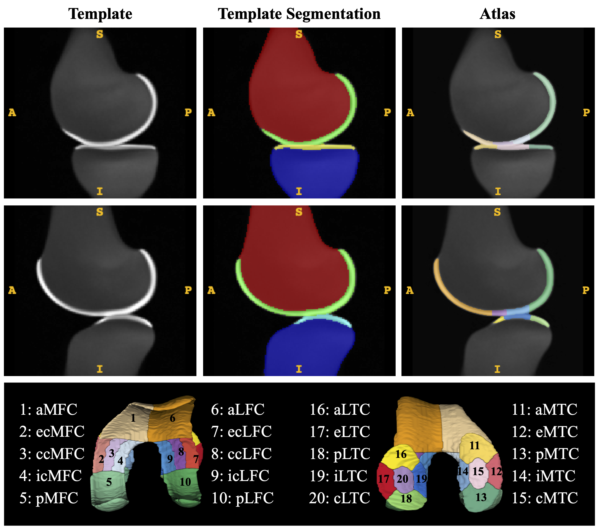
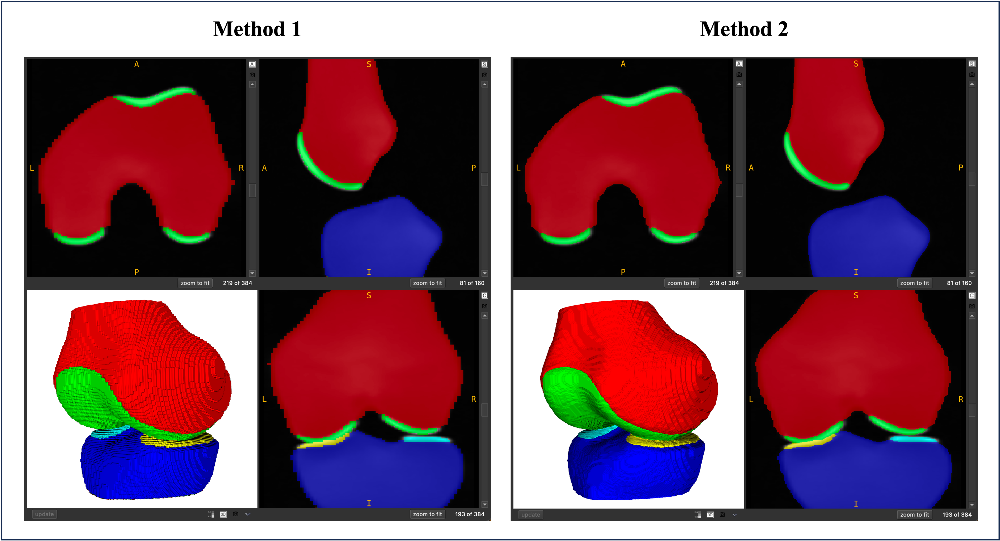

# Template & Atlas

## CLAIR-Knee-103R

The template image is learned from 103 MR images of subjects without radiographic OA ([dataset 1](https://github.com/YongchengYAO/CartiMorph/blob/main/Dataset/OAIZIB/CartiMorph_dataset1.xlsx)).

**Atlas Construction:**

We applied the rule-based parcellation algorithm to the template segmentation mask to build a cartilage atlas. Use our script ([`constructAtlas.m`](https://github.com/YongchengYAO/CartiMorph/blob/main/Scripts/CartiMorph/constructAtlas.m)) to do so.

- FC parcellation: [`CM_cal_VolumeParcellation_FC.m`](https://github.com/YongchengYAO/CartiMorph/blob/main/Scripts/CartiMorph/CM_cal_VolumeParcellation_FC.m)
- TC parcellation: [`CM_cal_VolumeParcellation_TC.m`](https://github.com/YongchengYAO/CartiMorph/blob/main/Scripts/CartiMorph/CM_cal_VolumeParcellation_TC.m)

**Resample Template Image &  Segmentation:**

We learned a low-resolution (64x128x128) template image in our study. We proposed 2 methods to resample the template image and segmentation mask.

- Resampling (Method 1): [`resample_Template_TempSeg_V1.m`](https://github.com/YongchengYAO/CartiMorph/blob/main/Scripts/CartiMorph/resample_Template_TempSeg_V1.m)
- Resampling & Smoothing (Method 2): [`resample_Template_TempSeg_V2.m`](https://github.com/YongchengYAO/CartiMorph/blob/main/Scripts/CartiMorph/resample_Template_TempSeg_V2.m)

**Related Data:**

- `CLAIR-Knee-103R_template_64x128x128.nii.gz`: the template image
- `CLAIR-Knee-103R_segmentation_64x128x128.nii.gz`: the 5-region template segmentation mask
- `CLAIR-Knee-103R_atlas_64x128x128.nii.gz`: the 20-region cartilage atlas

