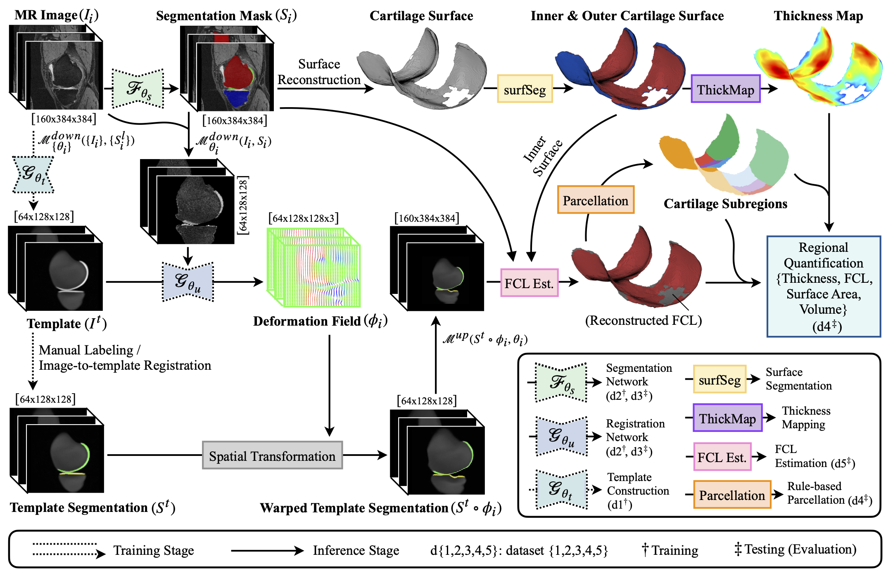

# CartiMorph

[Python: 3.10] [Matlab: 2022b]

This document provides the code and experimental results of our paper. We developed the **CartiMorph** framework in a hybrid programming environment of Python and Matlab. If you are interested in using **CartiMorph** for your research project, don’t hesitate to try our software [**CartiMorph Toolbox**](https://github.com/YongchengYAO/CartiMorph-Toolbox).

---

**Updates & Related Projects:**

- The code in this repository is **no longer updated** except for bugfix.
- We are updating the model training strategy, image analysis pipeline, and UI/UX design in some related projects, including
  - [CartiMorph Toolbox](https://github.com/YongchengYAO/CartiMorph-Toolbox): a platform for knee osteoarthritis monitoring and treatment evaluation
  - [CartiMorph-vxm](https://github.com/YongchengYAO/CartiMorph-vxm#cartimorph-vxm): template learning and image registration
  - [CartiMorph-nnUNet](https://github.com/YongchengYAO/CartiMorph-nnUNet#cartimorph-nnunet): image segmentation

---

<br/><br/>

## 1. Publication

CartiMorph: a framework for automated knee articular cartilage morphometrics. [[arxiv](https://arxiv.org/abs/2308.01981)] [[paper](https://doi.org/10.1016/j.media.2023.103035)]

[https://doi.org/10.1016/j.media.2023.103035](https://doi.org/10.1016/j.media.2023.103035)

```latex
@article{YAO2024103035,
title = {CartiMorph: A framework for automated knee articular cartilage morphometrics},
journal = {Medical Image Analysis},
author = {Yongcheng Yao and Junru Zhong and Liping Zhang and Sheheryar Khan and Weitian Chen},
volume = {91},
pages = {103035},
year = {2024},
issn = {1361-8415},
doi = {https://doi.org/10.1016/j.media.2023.103035}
}
```

- a method for automated cartilage thickness mapping that is robust to cartilage lesions
- a method for automated full-thickness cartilage loss (FCL) estimation
- a rule-based cartilage parcellation method that is robust to FCL



| Notation                                             | Meaning                                                    |
| ---------------------------------------------------- | ---------------------------------------------------------- |
| $I_i$                                                | MR image                                                   |
| $S_i$                                                | Segmentation mask                                          |
| $S_i^l$                                              | Manual segmentation label                                  |
| $I^t$                                                | Template image                                             |
| $S^t$                                                | Template segmentation mask                                 |
| $\mathcal{F}_{\theta_s}$                             | Segmentation model                                         |
| $\mathcal{G}_{\theta_t}$                             | Template learning model – essentially a registration model |
| $\mathcal{G}_{\theta_u}$                             | Registration model                                         |
| $\mathcal{M}^{\text{down}}_{\theta_i}(\cdot, \cdot)$ | Downsampling function (resampling & cropping)              |
| $\mathcal{M}^{\text{up}}(\cdot, \cdot)$              | Upsampling function (zero-filling & resampling)            |

<br/><br/>

## 2. Data

### 2.1 :rocket: Preprocessed Data: **OAIZIB-CM**

| Source       | link                                                         |
| ------------ | ------------------------------------------------------------ |
| Huggingface  | [here (recommended)](https://huggingface.co/datasets/YongchengYAO/OAIZIB-CM/tree/main) |
| Zenodo       | [here](https://zenodo.org/records/14934086)
| Google Drive | [here](https://drive.google.com/drive/folders/13_afAKSH7ZMOI_Nk2gfoihbJKwafw1l9?usp=share_link) |

This is the official release of **OAIZIB-CM** dataset 
- OAIZIB-CM is based on the OAIZIB dataset
  - OAIZIB paper: [Automated Segmentation of Knee Bone and Cartilage combining Statistical Shape Knowledge and Convolutional Neural Networks: Data from the Osteoarthritis Initiative](https://doi.org/10.1016/j.media.2018.11.009)
- In OAIZIB-CM, tibial cartilage is split into medial and lateral tibial cartilages.
- OAIZIB-CM includes [CLAIR-Knee-103R](https://github.com/YongchengYAO/CartiMorph/blob/main/Documents/TemplateAtlas.md), consisting of 
  - a template image learned from 103 MR images of subjects without radiographic OA
  - corresponding 5-ROI segmentation mask for cartilages and bones
  - corresponding 20-ROI atlas for articular cartilages
- It is compulsory to cite these papers if you use the dataset
  - [CartiMorph: A framework for automated knee articular cartilage morphometrics](https://doi.org/10.1016/j.media.2023.103035)
<br/>

### 2.2 Datasets and Data Split

MR images: [Osteoarthritis Initiative (OAI) dataset](https://nda.nih.gov/oai/)

Cartilage and bone segmentation masks: OAI-ZIB dataset

- 507 segmentations for DESS MRIs from the OAI database
- segmentation masks for the femur (ROI1), femoral cartilage (ROI2), tibia (ROI3), and tibial cartilage (ROI4)
- file format: `.raw` and `.mhd`

Data split in our study: 

| Dataset                                                      | Utility               | Size | KL Grade (KL0-4)  |
| ------------------------------------------------------------ | --------------------- | ---- | ----------------- |
| [dataset 1](https://github.com/YongchengYAO/CartiMorph/blob/main/Dataset/OAIZIB/CartiMorph_dataset1.xlsx) | template construction | 103  | 103/0/0/0/0       |
| [dataset 2](https://github.com/YongchengYAO/CartiMorph/blob/main/Dataset/OAIZIB/CartiMorph_dataset2.xlsx) | model training        | 383  | 82/46/86/111/58   |
| [dataset 3](https://github.com/YongchengYAO/CartiMorph/blob/main/Dataset/OAIZIB/CartiMorph_dataset3.xlsx) | model testing         | 98   | 21/12/22/28/15    |
| [dataset 4](https://github.com/YongchengYAO/CartiMorph/blob/main/Dataset/OAIZIB/CartiMorph_dataset4.xlsx) | framework evaluation  | 481  | 103/58/108/139/73 |
| [dataset 5](https://github.com/YongchengYAO/CartiMorph/blob/main/Dataset/OAIZIB/CartiMorph_dataset5.xlsx) | FCL manual grading    | 79   | 2/1/7/22/47       |

<br/>

### 2.3 Non-Image Data

We collected non-image data from the OAI dataset and created a [subject information table](https://github.com/YongchengYAO/CartiMorph/blob/main/Dataset/OAIZIB/OAIZIB_subject_info.xlsx) which contains the following fields:

- `SubjectID`: a unique ID for each subject 
- `Path`: the path of MR image in the OAI dataset (baseline cohort)
- `MRBarCode`: a unique ID for each MR image, used to find corresponding no-image data
- `KneeSide`: knee side (1 for right, 2 for left)
- `KLGrade`: Kellgren-Lawrence grade
- `Gender`: gender of the subject (1 for male, 2 for female)
- `Age`: age of the subject
- `BMI`: Body Mass Index of the subject

For more details on the construction of the table, please refer to [this page](https://github.com/YongchengYAO/CartiMorph/blob/main/Documents/prepareNonImageData.md).

<br/>

### 2.4 Preparing MRI Data

To reproduce and validate our work, follow the steps to prepare data or use the [preprocessed data](https://github.com/YongchengYAO/CartiMorph?tab=readme-ov-file#21-rocket-preprocessed-data-oaizib-cm).

1. Download MR images from the OAI baseline dataset using the image paths in the [subject information table](https://github.com/YongchengYAO/CartiMorph/blob/main/Dataset/OAIZIB/OAIZIB_subject_info.xlsx), and convert `.dcm` to `.nii.gz` format with tools like [dcm2niix](https://github.com/rordenlab/dcm2niix)

2. Download segmentation masks in `.raw`/`.mhd` format from the OAI-ZIB dataset

3. Use our script ([`raw2nii.py`](https://github.com/YongchengYAO/CartiMorph/blob/main/Scripts/data/raw2nii.py)) to convert `.raw`/`.mhd` files to `.nii.gz` files

   ```bash
   python raw2nii.py --path_raw /path/to/raw-mhd/folder --path_nii /path/to/nii/folder
   # or
   python raw2nii.py -i /path/to/raw-mhd/folder -o /path/to/nii/folder
   ```

4. Use our script ([`copyAffineMat_img2seg.m`](https://github.com/YongchengYAO/CartiMorph/blob/main/Scripts/data/copyAffineMat_img2seg.m)) to modify the affine transformation matrix in the NIfTI header of the segmentation mask 

   - that’s because the affine matrix is corrupt in `.mhd` files

5. Use our script ([`splitTC.m`](https://github.com/YongchengYAO/CartiMorph/blob/main/Scripts/data/splitTC.m)) to split the tibial cartilage into medial tibial cartilage (mTC) and lateral tibial cartilage (lTC)

   - you need to use the [subject information table](https://github.com/YongchengYAO/CartiMorph/blob/main/Dataset/OAIZIB/OAIZIB_subject_info.xlsx)

<br/><br/>

## 3. Methods

### 3.1 Image Standardisation

By implementing an image standardization scheme, the proposed framework is capable of processing images of different orientations and sizes. This involves reorienting all images to the RAS+ direction, where the first, second, and third dimensions of the image array correspond to the left-right, posterior-anterior, and inferior-superior directions, respectively.

Use our script ([`imgStandardisation.m`](https://github.com/YongchengYAO/CartiMorph/blob/main/Scripts/CartiMorph/imgStandardisation.m)) to standardise images and segmentation labels before model training and other algorithms. Use the preprocessed images in the remaining experiments.

<br/>

### 3.2 Knee Template Learning

**Model Training:**

1. Setup a Conda environment `CartiMorphToolbox-Vxm` with one of these:
   - `bash ./Scripts/envSetup/envSetup_CartiMorph-vxm.sh`
   - `conda env create -f ./Scripts/envSetup/CMT-Vxm.yml`
2. Prepare training data ([dataset 1](https://github.com/YongchengYAO/CartiMorph/blob/main/Dataset/OAIZIB/CartiMorph_dataset1.xlsx)) using our script ([`M_down.m`](https://github.com/YongchengYAO/CartiMorph/blob/main/Scripts/CartiMorph/M_down.m))
3. Train a model to learn a representative template image

   - [`training_scratch.sh`](https://github.com/YongchengYAO/CartiMorph/blob/main/Scripts/CartiMorph-vxm/training_scratch.sh): train a model from scratch
   - [`training_continue.sh`](https://github.com/YongchengYAO/CartiMorph/blob/main/Scripts/CartiMorph-vxm/training_continue.sh): continue training
4. Construct the segmentation mask for the learned template image

   1. Warp manual segmentation labels of training images to the template image space with our script ([`predicting_getTempSeg.sh`](https://github.com/YongchengYAO/CartiMorph/blob/main/Scripts/CartiMorph-vxm/predicting_getTempSeg.sh))
   2. Construct template segmentation with our script ([`constructTempSeg.m`](https://github.com/YongchengYAO/CartiMorph/blob/main/Scripts/CartiMorph/constructTempSeg.m))

:rocket: **Released Template: CLAIR-Knee-103R**

A knee template image (“**CLAIR-Knee-103R**”) was learned from 103 MR scans of subjects without radiographic OA. We also constructed the respective 5-class tissue segmentation and a 20-region cartilage atlas for the template image. For more information on the template and atlas, please go to the [Template & Atlas page](https://github.com/YongchengYAO/CartiMorph/blob/main/Documents/TemplateAtlas.md).

<br/>

### 3.3 Cartilage & Bone Segmentation

**Model Training:**

1. Setup a Conda environment  `CartiMorphToolbox-nnUNet` with one of these:

   - `bash ./Scripts/envSetup/envSetup_CartiMorph-nnUNet.sh`
   - `conda env create -f ./Scripts/envSetup/CMT-nnUNet.yml`

2. Image preprocessing

   1. Put your training data ([dataset 2](https://github.com/YongchengYAO/CartiMorph/blob/main/Dataset/OAIZIB/CartiMorph_dataset2.xlsx)) in the `imagesTr` and `labelsTr` folder

      ```python
      # arrange our training data like this:
      # ├── [nnUNet_raw_data]
      #     ├── [task_name]
      #         ├── imagesTr
      #         ├── imagesTs (optional)
      #         ├── labelsTr
      #         ├── labelsTs (optional)
      #
      # [nnUNet_raw_data] is the folder of raw data you set with the command:
      #   export nnUNet_raw_data_base='path/to/raw/data/folder/nnUNet_raw_data_base' 
      #
      # [task name] should be in the form of Task[xxx]_[task-name]
      ```
   2. modify [`generate_dataset_json.sh`](https://github.com/YongchengYAO/CartiMorph/blob/main/Scripts/CartiMorph-nnUNet/generate_dataset_json.sh) and [`generate_dataset_json.py`](https://github.com/YongchengYAO/CartiMorph/blob/main/Scripts/CartiMorph-nnUNet/generate_dataset_json.py), then run `generate_dataset_json.sh`

   3. preprocess data using our script ([`planning_preprocessing.sh`](https://github.com/YongchengYAO/CartiMorph/blob/main/Scripts/CartiMorph-nnUNet/planning_preprocessing.sh))

3. Train the model with our script

   - 2D model: [`training_2d.sh`](https://github.com/YongchengYAO/CartiMorph/blob/main/Scripts/CartiMorph-nnUNet/training_2d.sh)
   - 3D full-resolution model: [`training_3dF.sh`](https://github.com/YongchengYAO/CartiMorph/blob/main/Scripts/CartiMorph-nnUNet/training_3dF.sh)
   - 3D cascade model: [`training_3dL.sh`](https://github.com/YongchengYAO/CartiMorph/blob/main/Scripts/CartiMorph-nnUNet/training_3dL.sh) and [`training_3dCF.sh`](https://github.com/YongchengYAO/CartiMorph/blob/main/Scripts/CartiMorph-nnUNet/training_3dCF.sh)

**Model Inference:**

- modify and run our script
  - 2D model:  ([`predicting_2d.sh`](https://github.com/YongchengYAO/CartiMorph/blob/main/Scripts/CartiMorph-nnUNet/predicting_2d.sh))
  - 3D full-resolution model:  ([`predicting_3dF.sh`](https://github.com/YongchengYAO/CartiMorph/blob/main/Scripts/CartiMorph-nnUNet/predicting_3dF.sh))
  - 3D cascade model:  ([`predicting_3dCF.sh`](https://github.com/YongchengYAO/CartiMorph/blob/main/Scripts/CartiMorph-nnUNet/predicting_3dCF.sh))

**Model Ensemble:** (optional) 

1. determine the best-performing configurations with [`findBestConfig.sh`](https://github.com/YongchengYAO/CartiMorph/blob/main/Scripts/CartiMorph-nnUNet/findBestConfig.sh)
2. model prediction with our script
   - 2d-3dCF model: ([`predicting_2d3dCF.sh`](https://github.com/YongchengYAO/CartiMorph/blob/main/Scripts/CartiMorph-nnUNet/predicting_2d3dCF.sh))
   - 2d-3dF model: ([`predicting_2d3dF.sh`](https://github.com/YongchengYAO/CartiMorph/blob/main/Scripts/CartiMorph-nnUNet/predicting_2d3dF.sh))

**Model Evaluation:**

The model performance was evaluated by the Dice Similarity Coefficient (DSC) between the model prediction and manual segmentation. Use our script ([`cal_DSC.py`](https://github.com/YongchengYAO/CartiMorph/blob/main/Scripts/utility/cal_DSC.py)) to calculate the DSC for each segmentation label and subject. Use [dataset 3](https://github.com/YongchengYAO/CartiMorph/blob/main/Dataset/OAIZIB/CartiMorph_dataset3.xlsx) for model evaluation.

<br/>

### 3.4 Template-to-Image Registration

#### 3.4.1 Option 1: use the template learning model

The template learning model is trained with the MR images of healthy subjects. The training dataset is relatively small but consists of images of normal articular cartilages. The model is essentially an unsupervised registration model with a learnable template. Therefore we can use the model for image registration. 

**Model Inference:**

- modify and run our script for template-to-image registration ([`predicting_warpTempSeg.sh`](https://github.com/YongchengYAO/CartiMorph/blob/main/Scripts/CartiMorph-vxm/predicting_warpTempSeg.sh))

**Model Evaluation:**

We want to measure the model efficiency in template-to-image registration where the moving image is the template. The model performance was evaluated by the DSC between the warped template segmentation and the manual segmentation of the target image. Similarly, use our script ([`cal_DSC.py`](https://github.com/YongchengYAO/CartiMorph/blob/main/Scripts/utility/cal_DSC.py)) to calculate the DSC for each segmentation label and subject. Use [dataset 3](https://github.com/YongchengYAO/CartiMorph/blob/main/Dataset/OAIZIB/CartiMorph_dataset3.xlsx) for model evaluation.

#### 3.4.2 Option 2: train an image-to-image registration model with a diverse dataset

(This is the method described in our paper)

**Model Training:**

1. Setup a Conda environment `CartiMorphToolbox-Vxm` with one of these:
   - `bash ./Scripts/envSetup/envSetup_CartiMorph-vxm.sh`
   - `conda env create -f ./Scripts/envSetup/CMT-Vxm.yml`
2. Prepare training data ([dataset 2](https://github.com/YongchengYAO/CartiMorph/blob/main/Dataset/OAIZIB/CartiMorph_dataset1.xlsx)) using our script ([`M_down.m`](https://github.com/YongchengYAO/CartiMorph/blob/main/Scripts/CartiMorph/M_down.m))
3. Model training with our script:
   - Model-MSE: [`training_img2img_MSE.sh`](https://github.com/YongchengYAO/CartiMorph/blob/main/Scripts/CartiMorph-vxm/regModel/training_img2img_MSE.sh)
   - Model-MSE-x2:  [`training_img2img_MSE_x2.sh`](https://github.com/YongchengYAO/CartiMorph/blob/main/Scripts/CartiMorph-vxm/regModel/training_img2img_MSE_x2.sh)
   - Model-LNCC-x2:  [`training_img2img_LNCC_x2.sh`](https://github.com/YongchengYAO/CartiMorph/blob/main/Scripts/CartiMorph-vxm/regModel/training_img2img_LNCC_x2.sh)

**Model Inference:**

1. Estimate template-to-image deformation fields
   - Model-MSE: [`predicting_getField_MSE.sh`](https://github.com/YongchengYAO/CartiMorph/blob/main/Scripts/CartiMorph-vxm/regModel/predicting_getField_MSE.sh)
   - Model-MSE-x2: [`predicting_getField_MSE_x2.sh`](https://github.com/YongchengYAO/CartiMorph/blob/main/Scripts/CartiMorph-vxm/regModel/predicting_getField_MSE_x2.sh)
   - Model-LNCC-x2: [`predicting_getField_LNCC_x2.sh`](https://github.com/YongchengYAO/CartiMorph/blob/main/Scripts/CartiMorph-vxm/regModel/predicting_getField_LNCC_x2.sh)
2. Warp the template segmentation mask
   - Model-MSE: [`predicting_warpTempSeg_MSE.sh`](https://github.com/YongchengYAO/CartiMorph/blob/main/Scripts/CartiMorph-vxm/regModel/predicting_warpTempSeg_MSE.sh)
   - Model-MSE-x2: [`predicting_warpTempSeg_MSE_x2.sh`](https://github.com/YongchengYAO/CartiMorph/blob/main/Scripts/CartiMorph-vxm/regModel/predicting_warpTempSeg_MSE_x2.sh)
   - Model-LNCC-x2: [`predicting_warpTempSeg_LNCC_x2.sh`](https://github.com/YongchengYAO/CartiMorph/blob/main/Scripts/CartiMorph-vxm/regModel/predicting_warpTempSeg_LNCC_x2.sh)

**Model Evaluation:**

Although we have trained a model for image-to-image registration, we want to evaluate the model performance in template-to-image registration. In the model evaluation stage, we treated the learned template image as the moving image. The model performance was evaluated by the DSC between the warped template segmentation and manual segmentation of the target image. Similarly, use our script ([`cal_DSC.py`](https://github.com/YongchengYAO/CartiMorph/blob/main/Scripts/utility/cal_DSC.py)) to calculate the DSC for each segmentation label and subject. Use [dataset 3](https://github.com/YongchengYAO/CartiMorph/blob/main/Dataset/OAIZIB/CartiMorph_dataset3.xlsx) for model evaluation.

<br/>

### 3.5 Cartilage Morphometrics & Regional Analysis

We adopt the mathematical notations as those used in the paper. Each algorithm is followed by the corresponding mathematical notation and script. Note that we provide the code of core algorithms to improve the transparency of our work. The actual image processing pipeline is a bit more complicated since we have to manage the input/output (IO) between algorithms and adapt necessary postprocessing for some algorithms to improve the robustness.

We open-source the code with the hope of advancing medical image analysis techniques for OA monitoring and treatment evaluation. If you want to adopt the proposed **CartiMorph** framework in your research project, please use the [**CartiMorph Toolbox**](https://github.com/YongchengYAO/CartiMorph-Toolbox). 

- **Boundary Extractor**:     $\mathcal{O}_{\text{boundary}}(\cdot)$     [`CM_cal_getBoundary2D.m`](https://github.com/YongchengYAO/CartiMorph/blob/main/Scripts/CartiMorph/CM_cal_getBoundary2D.m)
- **Surface Closing:**     $\mathcal{O}_\text{closing}(\cdot | \cdot)$     [`CM_cal_surfaceClosing.m`](https://github.com/YongchengYAO/CartiMorph/blob/main/Scripts/CartiMorph/CM_cal_surfaceClosing.m)
- **Surface Dilation:**     $\mathcal{O}_{dilation}^{n_d}(\cdot | \cdot)$     [`CM_cal_surfaceDilation.m`](https://github.com/YongchengYAO/CartiMorph/blob/main/Scripts/CartiMorph/CM_cal_surfaceDilation.m)
- **Surface Erosion:**     $\mathcal{O}_{erosion}^{n_e}(\cdot | \cdot)$     [`CM_cal_surfaceErosion.m`](https://github.com/YongchengYAO/CartiMorph/blob/main/Scripts/CartiMorph/CM_cal_surfaceErosion.m)
- **Restricted Surface Dilation:**     $\mathcal{O}_\text{r-dilation}(\cdot | {\cdot, \cdot})$     [`CM_cal_surfaceDilation_restricted.m`](https://github.com/YongchengYAO/CartiMorph/blob/main/Scripts/CartiMorph/CM_cal_surfaceDilation_restricted.m)
- **Surface Normal Estimation**:     $\mathcal{O}_\text{SVD}(\mathcal{S}(P))$     [`CM_cal_estimateSN.m`](https://github.com/YongchengYAO/CartiMorph/blob/main/Scripts/CartiMorph/CM_cal_estimateSN.m)
- **Surface Normal Orientation Correction**:     $\mathcal{O}_\text{reorientation}(\cdot)$     [`CM_cal_reorientSN.m`](https://github.com/YongchengYAO/CartiMorph/blob/main/Scripts/CartiMorph/CM_cal_reorientSN.m)    
- **Surface Normal Spatial Smoothing**:     $\mathcal{O}_\text{smoothing}(\cdot)$     [`CM_cal_smoothSN.m`](https://github.com/YongchengYAO/CartiMorph/blob/main/Scripts/CartiMorph/CM_cal_smoothSN.m)
- **Thickness Measurement**:     $\mathcal{O}_\text{thickness}(\cdot)$     [`CM_cal_thicknessMap_SN.m`](https://github.com/YongchengYAO/CartiMorph/blob/main/Scripts/CartiMorph/CM_cal_thicknessMap_SN.m)  
- **Surface Hole Filling:**     $\mathcal{O}_\text{surface-filling}(\cdot , \cdot)$    
  - **Connectivity-based Surface Hole Filling:**     $\mathcal{O}_\text{conn}(\cdot , \cdot)$      [`CM_cal_reconCartDefect_conn.m`](https://github.com/YongchengYAO/CartiMorph/blob/main/Scripts/CartiMorph/CM_cal_reconCartDefect_conn.m)
  - **Curve-fitting-based Surface Hole Filling:**     $\mathcal{O}_\text{curve}(\cdot , \cdot)$ 
    - Femoral Cartilage: [`CM_cal_reconCartDefect_curve_FC.m`](https://github.com/YongchengYAO/CartiMorph/blob/main/Scripts/CartiMorph/CM_cal_reconCartDefect_curve_FC.m)
    - Tibial Cartilage:  [`CM_cal_reconCartDefect_curve_TC.m`](https://github.com/YongchengYAO/CartiMorph/blob/main/Scripts/CartiMorph/CM_cal_reconCartDefect_curve_TC.m)
- **Downsampling function (resampling & cropping)**:      $\mathcal{M}^\text{down}_{\theta_i}(\cdot, \cdot)$      [`M_down.m`](https://github.com/YongchengYAO/CartiMorph/blob/main/Scripts/CartiMorph/M_down.m)
- **Upsampling function (zero-filling & resampling)**:      $\mathcal{M}^\text{up}(\cdot, \cdot)$      [`M_up.m`](https://github.com/YongchengYAO/CartiMorph/blob/main/Scripts/CartiMorph/M_up.m)

**Other Algorithms:**

- **Surface Reconstruction**: [`CM_cal_mask2mesh.m`](https://github.com/YongchengYAO/CartiMorph/blob/main/Scripts/CartiMorph/CM_cal_mask2mesh.m)
- **Rule-based Cartilage Parcellation**:
  - Femoral Cartilage: [`CM_cal_SurfaceParcellation_FC.m`](https://github.com/YongchengYAO/CartiMorph/blob/main/Scripts/CartiMorph/CM_cal_SurfaceParcellation_FC.m)
  - Tibial Cartilage:  [`CM_cal_SurfaceParcellation_TC.m`](https://github.com/YongchengYAO/CartiMorph/blob/main/Scripts/CartiMorph/CM_cal_SurfaceParcellation_TC.m)

<br/><br/>

## 4. Experiment: Rule-based & Atlas-based Parcellation

In our study, we compared the rule-based and atlas-based cartilage parcellation methods by quantitative evaluation and visual inspection. Note that we took the segmentation labels $S^l_i$ as inputs to avoid errors arising from the segmentation model. We used [dataset 4](https://github.com/YongchengYAO/CartiMorph/blob/main/Dataset/OAIZIB/CartiMorph_dataset4.xlsx) for this experiment.

- **Quantitative Evaluation**: We evaluated the DSC between the parcellation outputs of the compared methods with our script ([`cal_DSC.py`](https://github.com/YongchengYAO/CartiMorph/blob/main/Scripts/utility/cal_DSC.py)). Results show that the discrepancy between the compared methods increased as the cartilage defects increased (from KL0 to KL4).
- **Visual Inspection**: The cartilage parcellation from the rule-based method is consistent with the subregion definition despite the severity of cartilage lesions.

**Algorithms:**

- Nearest-neighbor mapping function: [`CM_cal_nnMapping.m`](https://github.com/YongchengYAO/CartiMorph/blob/main/Scripts/CartiMorph/CM_cal_nnMapping.m)

<br/><br/>

## 5. Experiment: Validation of FCL Estimation

Three human raters graded the full-thickness cartilage loss (FCL)  into 11 categories independently. 

| Grade   | 0    | 1    | 2    | 3    | 4    | 5    | 6    | 7    | 8    | 9    | 10   |
| ------- | ---- | ---- | ---- | ---- | ---- | ---- | ---- | ---- | ---- | ---- | ---- |
| FCL (%) | <5   | 10   | 20   | 30   | 40   | 50   | 60   | 70   | 80   | 90   | >95  |

Semiquantitative measurements of the cartilage thickness, surface area, volume, and FCL were retrieved from the Pivotal Osteoarthritis Initiative Magnetic Resonance Imaging Analyses (POMA) dataset –  the “kmri_poma_tkr_chondrometrics” non-image dataset at https://nda.nih.gov/oai/

For details on how to find matching cases and compile [dataset 5](https://github.com/YongchengYAO/CartiMorph/blob/main/Dataset/OAIZIB/CartiMorph_dataset5.xlsx), please go to [this page](https://github.com/YongchengYAO/CartiMorph/blob/main/Documents/prepareData_FCL_validation.md).

:rocket: ​**Related Data:**

- All metrics (Chondrometrics): [`Chondrometrics_AllMetrics.xlsx`](https://github.com/YongchengYAO/CartiMorph/blob/main/Experiment/FCL_validation/Chondrometrics/Chondrometrics_AllMetrics.xlsx)
- FCL (dABp) (Chondrometrics): [`Chondrometrics_FCL.xlsx`](https://github.com/YongchengYAO/CartiMorph/blob/main/Experiment/FCL_validation/Chondrometrics/Chondrometrics_FCL.xlsx)
- FCL grading (rater 1): [`FCLgrading_rater1.xlsx`](https://github.com/YongchengYAO/CartiMorph/blob/main/Experiment/FCL_validation/Manual_FCL_Grading/FCLgrading_rater1.xlsx)
- FCL grading (rater 2): [`FCLgrading_rater2.xlsx`](https://github.com/YongchengYAO/CartiMorph/blob/main/Experiment/FCL_validation/Manual_FCL_Grading/FCLgrading_rater2.xlsx)
- FCL grading (rater 3): [`FCLgrading_rater3.xlsx`](https://github.com/YongchengYAO/CartiMorph/blob/main/Experiment/FCL_validation/Manual_FCL_Grading/FCLgrading_rater3.xlsx)

<br/><br/>


## 6. FAQ

For some frequently asked questions, please go to the [FAQ page](https://github.com/YongchengYAO/CartiMorph/blob/main/Documents/FAQ.md).

<br/><br/>

## 7. Application

[CartiMorph Toolbox](https://github.com/YongchengYAO/CartiMorph-Toolbox): a platform for knee osteoarthritis monitoring and treatment evaluation

<br/><br/>

## Acknowledgment

- We thank the Osteoarthritis Initiative (OAI) for sharing MR images and non-image clinical data –  [Osteoarthritis Initiative (OAI) dataset](https://nda.nih.gov/oai/)
- We thank the Computational Diagnosis and Therapy Planning Group of Zuse Institute Berlin (ZIB) for sharing the manual segmentation masks –  OAI-ZIB dataset (https://doi.org/10.1016/j.media.2018.11.009)

- Our work is partially based on the [nnUNet](https://github.com/MIC-DKFZ/nnUNet)
- Our work is partially based on the [VoxelMorph](https://github.com/voxelmorph/voxelmorph)
- Our work is partially based on the [Mesh Processing Toolbox](https://github.com/NicolasDouillet/mesh_processing_toolbox)
